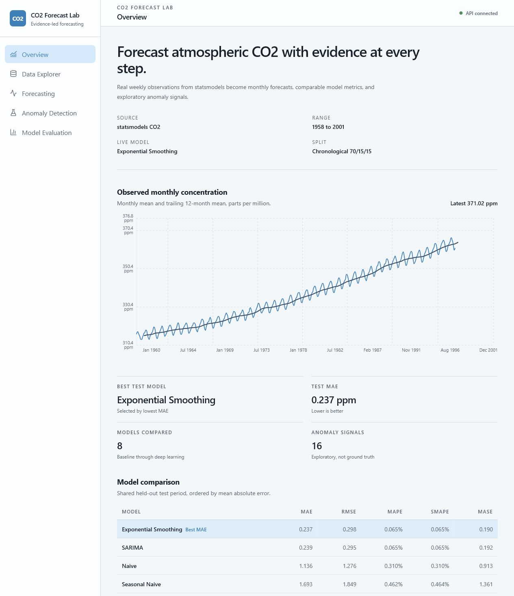
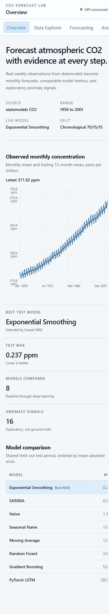

# Climate CO2 Forecasting ML

End-to-end time-series forecasting and exploratory anomaly detection using the real atmospheric CO2 dataset packaged with `statsmodels`.



## Project Overview

This portfolio project demonstrates a complete local-first ML workflow:

- real time-series ingestion and validation
- monthly resampling and leakage-safe feature engineering
- chronological train, validation, and test splits
- baseline, statistical, scikit-learn, and PyTorch forecasting
- shared forecast evaluation and residual analysis
- residual and Isolation Forest anomaly signals
- FastAPI inference endpoints
- responsive React, Vite, Tailwind CSS, and Recharts dashboard
- tests, Docker Compose, and GitHub Actions CI

## Dataset Source

The project uses the real weekly atmospheric CO2 dataset distributed with `statsmodels`:

```python
import statsmodels.api as sm

data = sm.datasets.co2.load_pandas().data
```

No Kaggle account, scraping, generated data, paid service, or external login is required.

Generated data summary:

- 2,284 weekly rows
- March 1958 through December 2001
- 59 missing weekly CO2 values before monthly interpolation
- 526 monthly observations after resampling

See [docs/data_source.md](docs/data_source.md).

## Problem Statement

Atmospheric CO2 contains a persistent upward trend and a strong annual cycle. The system forecasts future monthly concentration, compares models on one held-out period, and highlights unusual observations without presenting anomaly signals as verified climate events.

## Tech Stack

**ML/API:** Python 3.11, pandas, NumPy, statsmodels, scikit-learn, PyTorch, matplotlib, FastAPI, Pydantic

**Frontend:** React 19, TypeScript, Vite 8, Tailwind CSS 4, Recharts

**Engineering:** pytest, Docker Compose, GitHub Actions

## Architecture

```text
statsmodels CO2 data
        |
        v
load + validate
        |
        v
monthly preprocessing + chronological split
        |
        +--> baselines
        +--> Exponential Smoothing / SARIMA
        +--> Random Forest / Gradient Boosting
        +--> PyTorch LSTM
        |
        v
shared evaluation + anomaly detection
        |
        +--> FastAPI
        +--> React dashboard
```

## Project Structure

```text
src/
  data/         loading and validation
  features/     monthly preprocessing and feature engineering
  models/       baseline, statistical, ML, and LSTM training
  evaluation/   shared metrics and comparison reports
  anomaly/      residual and Isolation Forest detection
  api/          FastAPI schemas, service, and endpoints
  eda/          reproducible EDA report generation
frontend/       React/Vite dashboard
notebooks/      explanatory EDA notebook
tests/          data, preprocessing, schema, metric, and API tests
reports/        generated metrics, figures, anomalies, and screenshots
docs/           implementation and deployment documentation
```

## Setup

### Windows PowerShell

```powershell
python -m venv .venv
.\.venv\Scripts\Activate.ps1
python -m pip install -r requirements.txt
```

### macOS/Linux

```bash
python -m venv .venv
source .venv/bin/activate
python -m pip install -r requirements.txt
```

## Data Loading

```bash
python -m src.data.load_co2
python -m src.data.validate_data
python -m src.features.preprocess_timeseries
```

Outputs:

- `data/raw/co2_raw.csv`
- `data/processed/co2_monthly.csv`
- `data/processed/co2_features.csv`
- `reports/dataset_metadata.md`
- `reports/data_validation_report.md`

## EDA

```bash
python -m src.eda.generate_eda
jupyter notebook notebooks/01_eda.ipynb
```

The EDA covers missing values, trend, rolling statistics, decomposition, autocorrelation, seasonality, and stationarity.

## Forecasting Models

```bash
python -m src.models.train_baselines
python -m src.models.train_statistical
python -m src.models.train_ml_regressors
python -m src.models.train_lstm --debug
python -m src.models.train_lstm --epochs 100 --lookback 24 --batch-size 16 --seed 42
```

The generated report uses the fast LSTM debug run to prove the CPU pipeline. Run the 100-epoch command before treating LSTM performance as a serious model result.

## Evaluation Metrics

- MAE
- RMSE
- MAPE
- sMAPE
- MASE against a 12-month seasonal scale

```bash
python -m src.evaluation.evaluate_forecasts
```

## Model Results

| Model | MAE | RMSE | MAPE | sMAPE | MASE | Notes |
|---|---:|---:|---:|---:|---:|---|
| Exponential Smoothing | 0.237 | 0.298 | 0.065% | 0.065% | 0.190 | Best rolling one-step MAE |
| SARIMA | 0.239 | 0.295 | 0.065% | 0.065% | 0.192 | Close statistical challenger |
| Naive | 1.136 | 1.276 | 0.310% | 0.310% | 0.913 | Strong one-step baseline |
| Seasonal Naive | 1.693 | 1.849 | 0.462% | 0.464% | 1.361 | Annual benchmark |
| Moving Average | 1.988 | 2.290 | 0.542% | 0.543% | 1.598 | 12-month mean |
| Random Forest | 3.991 | 5.005 | 1.081% | 1.090% | 3.208 | Lag and rolling features |
| Gradient Boosting | 5.847 | 6.858 | 1.586% | 1.603% | 4.700 | Lag and rolling features |
| PyTorch LSTM | 28.009 | 28.235 | 7.636% | 7.944% | 22.513 | Two-epoch debug run |

Result: the statistical models outperform more complex methods on this small,
structured series under rolling one-step evaluation.

## Anomaly Detection

```bash
python -m src.anomaly.detect_anomalies
```

The report combines:

1. residual thresholding from the best held-out forecast model
2. Isolation Forest over observed lag, rolling, and calendar features

Current output contains 16 exploratory Isolation Forest signals and no residual-threshold signals. These are not ground-truth events.

## API Usage

```bash
uvicorn src.api.main:app --reload --port 8000
```

| Endpoint | Purpose |
|---|---|
| `GET /health` | Service and model status |
| `GET /model-info` | Active model and evaluation metrics |
| `GET /historical-data` | Monthly CO2 and rolling mean |
| `GET /forecast?horizon_months=24` | 1-60 month forecast |
| `GET /anomalies` | Exploratory anomaly rows |

Swagger UI: `http://localhost:8000/docs`

## Frontend Usage

```bash
cd frontend
npm install
npm run dev
```

Set `VITE_API_URL` when the API is not at `http://localhost:8000`.

The dashboard includes Overview, Data Explorer, Forecasting, Anomaly Detection, and Model Evaluation pages with loading and API-unavailable states.

## Docker

```bash
docker compose up --build
```

- Frontend: `http://localhost:5173`
- API: `http://localhost:8000`
- API docs: `http://localhost:8000/docs`

Docker remains optional. Python and npm workflows work independently.

## Testing

```bash
pytest
cd frontend
npm run lint
npm run build
```

See [docs/verification.md](docs/verification.md) for the latest full pipeline,
notebook, Docker, API, and browser verification record.

## Screenshots

### Desktop


### Mobile



## Limitations

- The dataset is small compared with industrial forecasting datasets.
- Long-horizon uncertainty grows beyond the observed period.
- The live API interval is a residual-based approximation, not full probabilistic calibration.
- Isolation Forest signals reflect the chosen feature space and contamination assumption.
- Anomaly signals do not represent verified climate events.
- Tree models do not extrapolate the long-term trend well.
- The generated LSTM result is a debug smoke run, not tuned training.
- The project does not ingest current live NOAA observations.

## Future Improvements

- run and track full LSTM experiments
- compare calibrated prediction intervals
- add time-series cross-validation and hyperparameter tuning
- add local MLflow experiment tracking
- ingest a stable live NOAA source
- add hosted read-only portfolio mode
- export dashboard reports to PNG or PDF

## Resume Bullet

Built a local-first atmospheric CO2 forecasting platform that evaluated eight baseline, statistical, tree-based, and PyTorch models on a leakage-safe chronological test set, served forecasts through FastAPI, and visualized trend, uncertainty, model errors, and anomaly signals in a responsive React dashboard.

See [PORTFOLIO_REVIEW.md](PORTFOLIO_REVIEW.md) for presentation guidance and remaining gaps.
